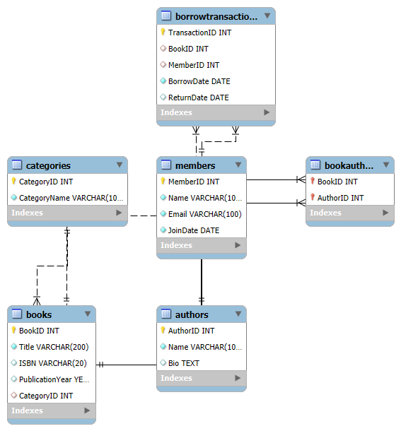

# 📚 Library Database Project

A simple and well-structured relational database for managing a library system using MySQL.

This project includes:
- SQL schema to create all necessary tables and relationships
- Dummy data for testing
- Entity Relationship Diagram (ERD)

---

## 🗂️ Project Structure

| File | Description |
|------|-------------|
| `library_schema.sql` | SQL script to create tables and define relationships |
| `library_schema.sql.mwb` | MySQL Workbench model file |
| `ERD.png` | Visual ER diagram of the database |

---

## 📌 Key Features

- Entities: Books, Authors, Categories, Members, Transactions
- Supports many-to-many (Book–Author) and one-to-many (Category, Borrow) relationships
- Includes foreign keys and primary key constraints
- Sample data for quick testing

---

## 🛠️ How to Use

1. Import or run `library_schema.sql` in MySQL Workbench or any MySQL-compatible database.
2. (Optional) Use the `.mwb` file to view/edit the model in MySQL Workbench.
3. View the ERD in `ERD.png` for schema understanding.

---

## 📷 ER Diagram

---

## 👩‍💻 Created by

Aakanksha Patil  
🚀 *Aspiring Data Scientist | BCA Student | Exploring Databases & Web Development*

---

